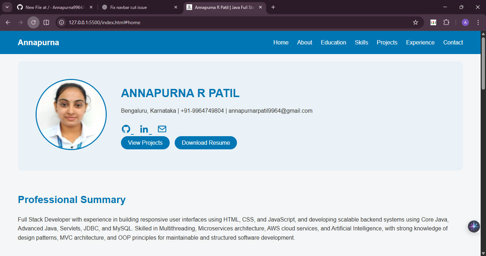
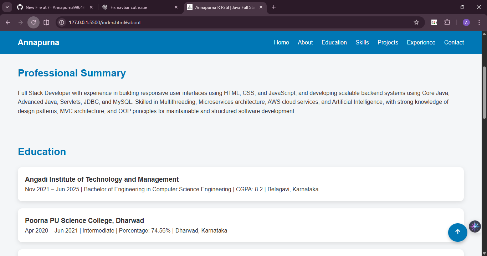
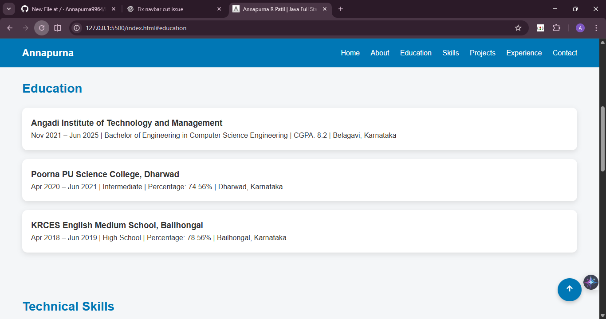
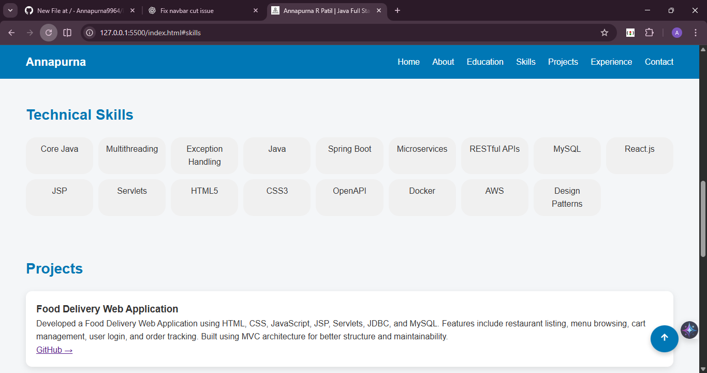
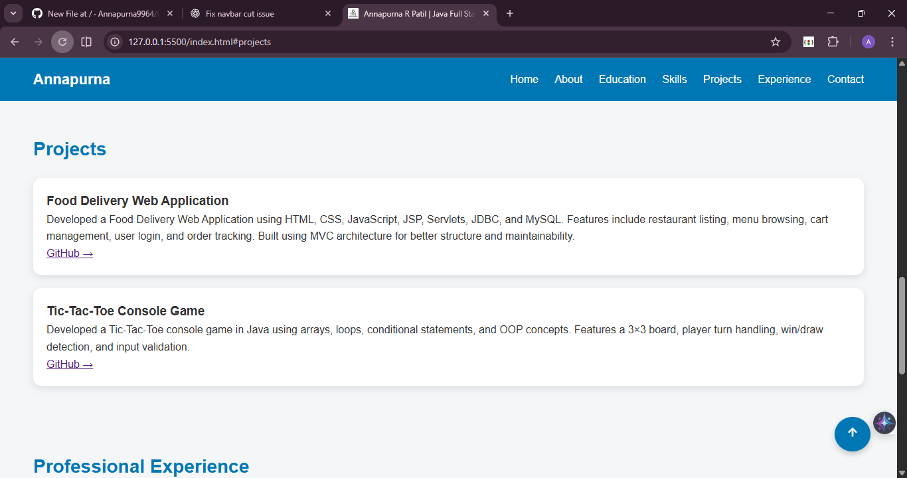
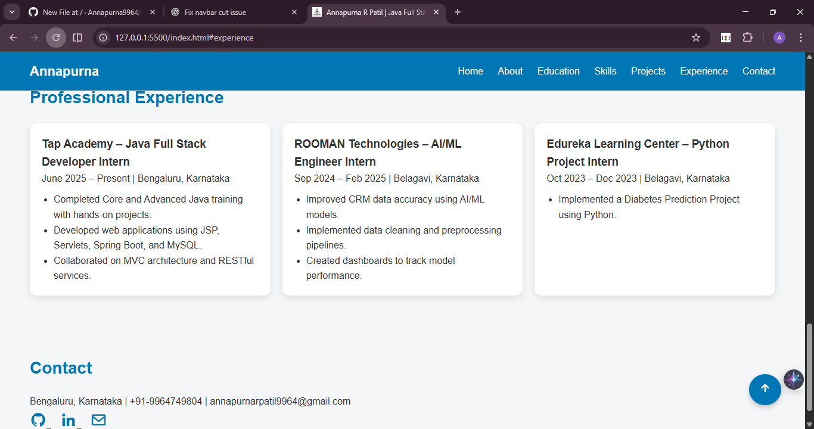
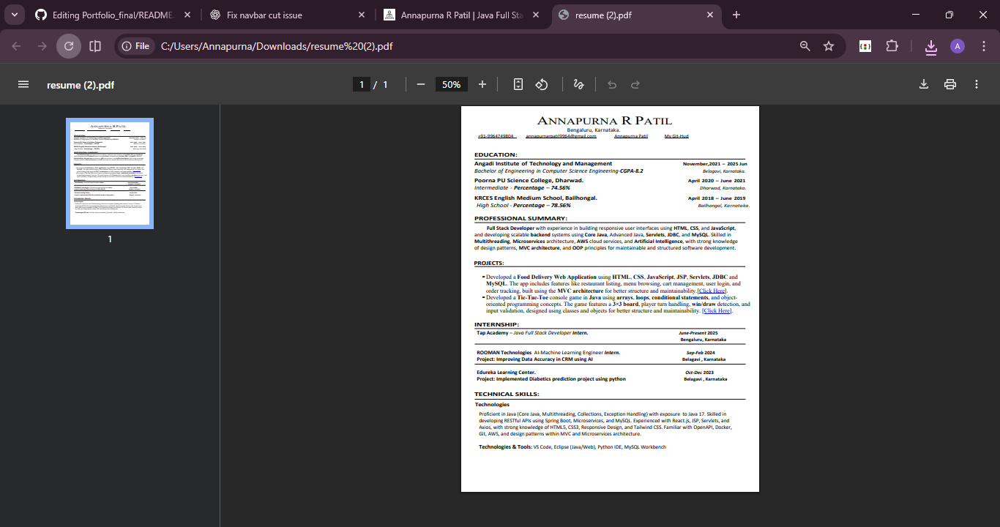

# 🌐 Personal Portfolio Website

This is my personal portfolio website, developed using **HTML, CSS, and JavaScript**.  
It showcases my profile, technical skills, education, projects, experience, and contact details in a clean and professional manner.  
The website is fully responsive and designed to create a strong online presence for recruiters and hiring managers.

---

## 🚀 Features

- 🏠 **Home Section:** Displays my name, role, and a brief introduction.
- 👩‍💻 **About Section:** Highlights my professional summary and career objective.
- 🎓 **Education Section:** Shows academic qualifications and certifications.
- 🛠️ **Skills Section:** Lists technical skills and tools.
- 📂 **Projects Section:** Showcases my major academic and personal projects.
- 💼 **Experience Section:** Displays internship and training experience.
- 📞 **Contact Section:** Provides contact details and social media links.
- 📄 **Resume Download:** Option to view or download my resume.

---

## 🖼️ Screenshots

Screenshots below represent different sections of the portfolio website.

---

### 🏠 Home Section
Displays name, role, and call-to-action buttons.

---

### 👩‍💻 About Section
Highlights professional summary, background, and career objective.

---

### 🎓 Education Section
Shows academic qualifications and certifications.

---

### 🛠️ Skills Section
Displays technical skills and tools.

---

### 📂 Projects Section
Showcases major academic and personal projects with descriptions and links.

---

### 💼 Experience Section
Displays internship and training experience.

---

### 📞 Contact Section
Provides contact details and social media links.

---

### 📄 Resume Section
Option to view or download resume.

---

## 🛠️ Tech Stack

| Category | Technologies |
|--------|--------------|
| Frontend | HTML, CSS, JavaScript |
| Tools | Git, GitHub, VS Code |

---

## 📌 How to Run the Project

1. Clone the repository  
2. Open the project folder  
3. Open `index.html` in any browser  
4. (Optional) Use VS Code **Live Server** for better experience  

---

## 👩‍💻 Developer

**Annapurna R Patil**  
Java Full Stack Developer  

Made with ❤️ using Web Technologies
